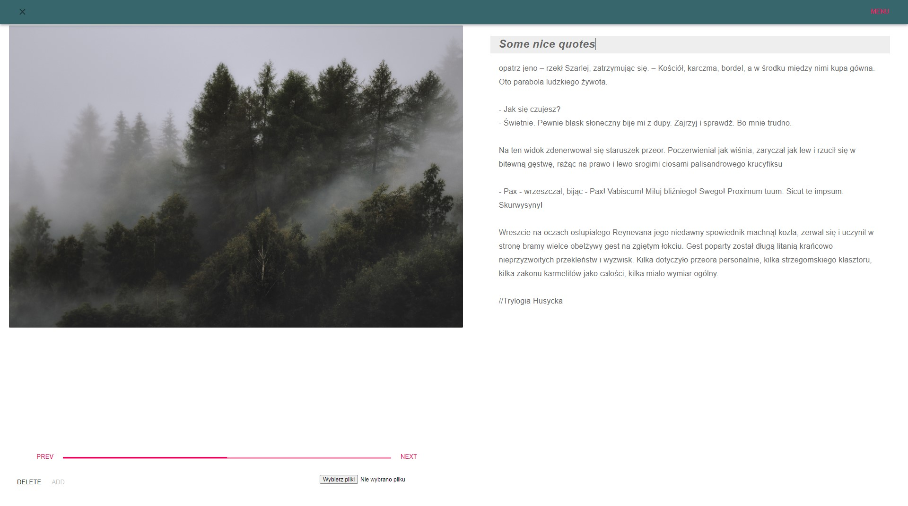

# Gallery App

---

Simple online gallery which keeps images with descriptions, built with React and Firebase

### Aim and functionality

---

This app was created for learning general React functionality combined with database usage. It also use Material-ui library for visual layout.

App allows creating cards displayed on main table, each of card contains set of images with description, both are editable in individual card view. Cards can be added, removed of filtered by titles. Layout is also adapted for mobile view

#### Main table view

#### Card view

### Installation and setup

---

Clone this repo and go to its root, you need have `npm` installed

###### Installation

`npm install`

###### Starting server

`npm start`

will run on [http://localhost:3000](http://localhost:3000) server

###### Build

`npm run build`

#### Technologies:

---

*  React 16.13.1
*  React Router 5.2.0
*  Material-ui 4.11.0
*  Firebase 7.15.5
